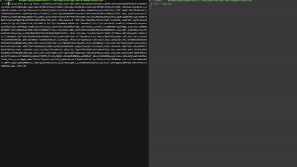

# Python Entra JWT Validation
Python Entra JWT Validation is a middleware that validates the JWT token in the request header. It is an example to validate JWT given by Microsoft Entra for AWS Lambda Authorizer.

## Installation
```bash
pip install pyjwt
pip install cryptography
pip install requests
pip install python-dotenv

# Additional dependencies
pip install 'urllib3<2.0'

# For Mac users
brew install openssl
```

# Usage
```bash
python main.py Bearer {TOKEN}
```

## Environment Variables
Create a `.env` file in the root directory and add the following variables:
```bash
TENANT_ID={TENANT_ID}
CLIENT_IDS={CLIENT_IDS}
```

## Output



## Referenced from:
- https://learn.microsoft.com/en-us/entra/identity-platform/access-tokens